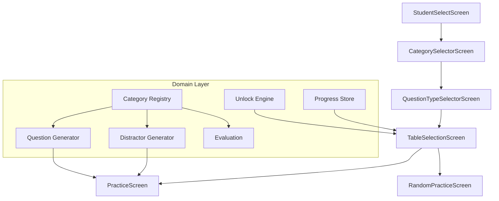

# Design Document: Multi-Category Math Trainer

## Overview

This feature transforms the Math Trainer from a single-operation, single-question-type app into an **extensible, multi-category, multi-question-type platform**. The central design principle is the **Category Registry pattern**: a data-driven registry defines categories (addition, multiplication at launch), and all downstream behavior — question generation, answer evaluation, display, progress tracking, and unlocks — derives from registry entries. No conditional branches reference specific category identifiers.

A second axis of variation is introduced via **Question Types**: "Questão Aberta" (typed open answer) and "Múltipla Escolha" (multiple choice with 4 options). The combination of a category and a question type forms a **Progress_Key** — an independent progress track with its own unlock state, statistics, and localStorage persistence.

At launch the system has 4 Progress_Keys:
- `addition-open`
- `addition-multiple-choice`
- `multiplication-open`
- `multiplication-multiple-choice`

The navigation flow deepens to: **Student_Select → Category_Selector → Question_Type_Selector → Table_Selection → Practice**.

The architecture preserves the existing conventions: domain-pure functions, React context for state, plain CSS, localStorage persistence, and state-driven navigation.

## Architecture



### Key Design Decisions

1. **Registry-driven categories** — A `CategoryRegistry` module exports a `Map<string, CategoryDefinition>`. All components iterate over registry entries; no component imports a hardcoded category list. Adding a new category (e.g., subtraction) requires only a new entry in the registry module.

2. **Progress_Key as a first-class concept** — The tuple `(categoryId, questionTypeId)` is encoded as a string `"{categoryId}-{questionTypeId}"` and serves as the partitioning key for progress, unlock state, and localStorage keys.

3. **Shared generic components** — `PracticeScreen`, `TableSelectionScreen`, `FeedbackOverlay`, `SessionTimer`, and `AnswerInput` are parameterized by Progress_Key. There is one `PracticeScreen` that renders either open-answer input or multiple-choice options based on the active question type.

4. **Distractor generation as a pure domain function** — Distractors are computed from nearby operations within the same category (adjusting operand B by offsets ±1..±3), with a fallback to offset from correct answer. This keeps distractors plausible and pedagogically valuable.

5. **Separate localStorage key per Progress_Key per student** — Pattern: `math-trainer-progress-{studentId}-{categoryId}-{questionTypeId}`. Write isolation is absolute: writing one key never touches another.

6. **Question type as a rendering concern** — The domain layer generates questions identically regardless of question type. The question type only affects how the answer is collected (typed vs. selected) and whether distractors are generated.

7. **Existing multiplication behavior preserved** — The current open-answer multiplication flow becomes one of the four Progress_Keys. Data migration maps the existing `math-trainer-progress-{studentId}` key to `math-trainer-progress-{studentId}-multiplication-open`.

## Components and Interfaces

### New Components

| Component | Responsibility |
|-----------|---------------|
| `CategorySelectorScreen` | Renders one option per registry entry; navigates to Question_Type_Selector |
| `QuestionTypeSelectorScreen` | Displays "Questão Aberta" and "Múltipla Escolha" for the selected category |
| `MultipleChoiceInput` | Renders 4 shuffled option buttons; reports selected value |

### Modified Components

| Component | Change |
|-----------|--------|
| `TableSelectionScreen` | Receives Progress_Key; shows lock/unlock state for that key |
| `PracticeScreen` | Renders `AnswerInput` or `MultipleChoiceInput` based on question type; uses category operator from registry |
| `RandomPracticeScreen` | Same as PracticeScreen but for random mode within a Progress_Key |
| `QuestionDisplay` | Renders operator symbol from category registry (not hardcoded `×`) |
| `StatsScreen` | Organized by category → question type, showing 4 sections |
| `UnlockCelebration` | Shows category name + question type in celebration message |
| `App.tsx` | Extended Screen type with category-select, question-type-select states |
| `ProgressContext` | Manages active Progress_Key; loads/saves per-key progress |

### New Domain Modules

| Module | Responsibility |
|--------|---------------|
| `domain/category-registry.ts` | `CategoryDefinition` interface, registry map, `getCategory()`, `getAllCategories()`, duplicate/validation guards |
| `domain/distractor-generator.ts` | `generateDistractors(question, category)` → 3 plausible distractors |
| `domain/progress-key.ts` | `ProgressKey` type, `buildProgressKey()`, `parseProgressKey()`, `getStorageKey(studentId, progressKey)` |

### Modified Domain Modules

| Module | Change |
|--------|--------|
| `domain/questions.ts` | `generateSessionQuestions(tableNumber, category)` uses `category.compute`; question carries `categoryId` |
| `domain/persistence.ts` | Generalized to accept Progress_Key; key pattern changed |
| `domain/evaluation.ts` | Unchanged — still compares `userAnswer === question.correctAnswer` |
| `domain/stats.ts` | Unchanged — pure math |
| `domain/unlock.ts` | Unchanged — operates on numeric stats only |

### Interfaces

```typescript
// domain/category-registry.ts
export interface CategoryDefinition {
  id: string;               // e.g., "addition", "multiplication"
  label: string;            // e.g., "Soma", "Multiplicação"
  operator: string;         // e.g., "+", "×"
  icon: string;             // icon identifier
  compute: (a: number, b: number) => number;
}

// domain/progress-key.ts
export type QuestionTypeId = "open" | "multiple-choice";
export type ProgressKey = `${string}-${QuestionTypeId}`;

export function buildProgressKey(categoryId: string, questionTypeId: QuestionTypeId): ProgressKey;
export function parseProgressKey(key: ProgressKey): { categoryId: string; questionTypeId: QuestionTypeId };
export function getStorageKey(studentId: string, progressKey: ProgressKey): string;

// domain/distractor-generator.ts
export function generateDistractors(
  question: Question,
  category: CategoryDefinition
): [number, number, number]; // exactly 3 distractors
```

## Data Models

### Extended Types (`src/types/index.ts`)

```typescript
export type QuestionTypeId = "open" | "multiple-choice";

export interface Question {
  factorA: number;           // table number (2–10)
  factorB: number;           // operand (1–10)
  correctAnswer: number;     // category.compute(factorA, factorB)
  categoryId: string;        // e.g., "addition"
}

export interface TableStats {
  tableNumber: number;
  totalAnswered: number;
  totalCorrect: number;
  masteryLevel: number;      // Math.round((totalCorrect / totalAnswered) * 100)
}

export interface Progress {
  unlockedTables: number[];                   // starts with [2]
  tableStats: Record<number, TableStats>;
  totalAnswered: number;
  totalCorrect: number;
  randomStats: { totalAnswered: number; totalCorrect: number };
}

export interface StoredProgress {
  version: 1;
  unlockedTables: number[];
  tableStats: Record<string, { totalAnswered: number; totalCorrect: number }>;
  randomStats?: { totalAnswered: number; totalCorrect: number };
}

// Navigation
export type Screen =
  | { type: "student-select" }
  | { type: "category-select" }
  | { type: "question-type-select"; categoryId: string }
  | { type: "table-selection"; categoryId: string; questionTypeId: QuestionTypeId }
  | { type: "practice"; categoryId: string; questionTypeId: QuestionTypeId; tableNumber: number }
  | { type: "random-practice"; categoryId: string; questionTypeId: QuestionTypeId }
  | { type: "stats" };

export interface Student {
  id: string;
  name: string;
  createdAt: string;
}
```

### localStorage Key Pattern

| Key | Purpose |
|-----|---------|
| `math-trainer-progress-{studentId}-{categoryId}-{questionTypeId}` | Per-Progress_Key progress |
| `math-trainer-students` | Student list |
| `math-trainer-active-student` | Active student ID |

### Category Registry (launch entries)

| ID | Label | Operator | Compute |
|----|-------|----------|---------|
| `addition` | Soma | `+` | `(a, b) => a + b` |
| `multiplication` | Multiplicação | `×` | `(a, b) => a * b` |

### Distractor Generation Algorithm

1. Compute candidate set: for offsets `[-3, -2, -1, +1, +2, +3]`, compute `category.compute(factorA, factorB + offset)` for each valid `factorB + offset` in [1, 10]
2. Filter: remove duplicates, remove the correct answer, remove values < 1
3. If 3+ candidates remain: select 3 at random
4. Fallback: compute `[correctAnswer - 2, correctAnswer - 1, correctAnswer + 1, correctAnswer + 2]`, filter out correct answer and values < 1, select 3 distinct values
5. Shuffle all 4 options (1 correct + 3 distractors) for display


## Correctness Properties

*A property is a characteristic or behavior that should hold true across all valid executions of a system — essentially, a formal statement about what the system should do. Properties serve as the bridge between human-readable specifications and machine-verifiable correctness guarantees.*

### Property 1: Category registry validation

*For any* category definition registered in the Category_Registry, its `id` SHALL be a non-empty string of at most 32 characters matching `[a-z0-9-]+`, its `label` SHALL be a non-empty string of at most 50 characters, its `operator` SHALL be a non-empty string of at most 3 characters, and its `compute` function SHALL return a finite number for any two finite numeric operands.

**Validates: Requirements 1.1**

### Property 2: Duplicate and invalid category rejection

*For any* category definition whose `id` already exists in the registry, registration SHALL throw an error. *For any* category definition missing or having an empty value for any required field (id, label, operator, icon, compute), registration SHALL throw an error.

**Validates: Requirements 1.4, 1.5**

### Property 3: Question generation structure validity

*For any* table number N in [2, 10] and *for any* category in the registry, every question produced by `generateSessionQuestions(N, category)` SHALL have `factorA === N`, `factorB` in [1, 10], `correctAnswer === category.compute(N, factorB)`, and `categoryId === category.id`.

**Validates: Requirements 5.1, 5.4, 14.5**

### Property 4: Cycle completeness

*For any* table number N in [2, 10] and *for any* category, `generateSessionQuestions(N, category)` SHALL return exactly 10 questions whose `factorB` values form a permutation of [1, 2, 3, 4, 5, 6, 7, 8, 9, 10].

**Validates: Requirements 5.2**

### Property 5: Cycle boundary non-repetition

*For any* completed session (currentIndex equals questions.length), calling `getNextQuestion` SHALL return a session whose first question has a `factorB` value different from the last question's `factorB` in the previous cycle.

**Validates: Requirements 5.3**

### Property 6: Random batch validity

*For any* category, `generateRandomSessionQuestions(category)` SHALL produce exactly 10 questions, each with `factorA` in [3, 9], `factorB` in [1, 10], `correctAnswer === category.compute(factorA, factorB)`, and `categoryId === category.id`.

**Validates: Requirements 5.5**

### Property 7: Random batch boundary non-repetition

*For any* exhausted random session, generating the next batch SHALL produce a first question that differs from the previous batch's last question in either `factorA` or `factorB`.

**Validates: Requirements 5.6**

### Property 8: Distractor generation validity

*For any* valid question (factorA in [2, 10], factorB in [1, 10]) and *for any* category, `generateDistractors(question, category)` SHALL return exactly 3 integers, all ≥ 1, all distinct from each other, and all distinct from the question's `correctAnswer`. Furthermore, the set of 4 values (correctAnswer + 3 distractors) SHALL contain no duplicates.

**Validates: Requirements 6.1, 6.2, 6.3, 6.6, 6.7**

### Property 9: Progress persistence round-trip and write isolation

*For any* valid Progress object and *for any* Progress_Key, saving progress for that key and then loading it SHALL produce an equivalent object (with masteryLevel recalculated from stored totals). Furthermore, saving progress for one Progress_Key SHALL NOT modify the localStorage content of any other Progress_Key.

**Validates: Requirements 9.1, 9.4, 12.1, 12.4**

### Property 10: Persistence resilience

*For any* Progress_Key whose localStorage data is absent, unparseable, or structurally invalid (version ≠ 1, invalid unlockedTables, negative integers, totalCorrect > totalAnswered), loading SHALL return the default progress state (unlockedTables = [2], empty tableStats, totalAnswered = 0, totalCorrect = 0) without reading, modifying, or invalidating data stored under any other Progress_Key.

**Validates: Requirements 9.5, 12.2, 12.3, 12.5**

### Property 11: Mastery level calculation

*For any* non-negative integers `totalCorrect` and `totalAnswered` where `totalCorrect ≤ totalAnswered` and `totalAnswered > 0`, `calculateMasteryLevel(totalCorrect, totalAnswered)` SHALL return `Math.round((totalCorrect / totalAnswered) * 100)`. If `totalAnswered === 0`, it SHALL return 0.

**Validates: Requirements 9.3, 4.3**

### Property 12: Unlock progression

*For any* TableStats where `totalAnswered ≥ 10` AND `masteryLevel ≥ 80`, `shouldUnlockNext` SHALL return true. *For any* `unlockedTables` array where `max(unlockedTables) < 10`, `getNextTableToUnlock` SHALL return `max(unlockedTables) + 1`. *For any* `unlockedTables` containing 10, `getNextTableToUnlock` SHALL return null.

**Validates: Requirements 10.2, 10.3, 10.4, 10.7**

### Property 13: Storage key construction

*For any* valid student ID and *for any* Progress_Key composed of (categoryId, questionTypeId), `getStorageKey(studentId, progressKey)` SHALL return the string `"math-trainer-progress-{studentId}-{categoryId}-{questionTypeId}"`.

**Validates: Requirements 14.3, 12.1**

## Error Handling

| Scenario | Handling |
|----------|----------|
| Progress_Key localStorage key absent | Return default progress (table 2 unlocked, all stats zero) |
| localStorage key contains unparseable JSON | Return default progress for that key; other keys unaffected |
| Stored data fails structural validation | Return default progress; do not modify other keys |
| localStorage unavailable (throws on write) | Continue with in-memory progress; no unhandled exception |
| Category registry has zero entries | Display "no categories available" message on Category_Selector |
| Duplicate category registration | Throw descriptive error at registration time |
| Missing required field on category registration | Throw descriptive error indicating missing field |
| Distractor generation cannot find 3 nearby candidates | Fallback to correctAnswer ± offsets |
| Student has no progress for a Progress_Key (new combination) | Initialize with default progress on first access |
| factorB near boundary (1 or 10) for distractor generation | Fewer nearby candidates available; fallback ensures 3 distractors |

## Testing Strategy

### Unit Tests (Example-Based)

Unit tests cover concrete UI scenarios, navigation flows, and edge cases:

- **CategorySelectorScreen**: Renders options for each registered category; navigates on click; handles empty registry
- **QuestionTypeSelectorScreen**: Renders two options with category name; navigates correctly for each choice
- **TableSelectionScreen**: Shows lock/unlock state per Progress_Key; locked tables are non-interactive
- **PracticeScreen (open)**: Renders input field, validates submission, shows feedback
- **PracticeScreen (multiple-choice)**: Renders 4 options, handles selection, shows feedback
- **MultipleChoiceInput**: Renders 4 buttons with shuffled options; reports selected value
- **StatsScreen**: Shows 4 sections; handles zero-state
- **UnlockCelebration**: Shows category name + question type in message
- **Navigation**: Full flow Student_Select → Category → QuestionType → Table → Practice; back button at each level
- **FeedbackOverlay**: Correct auto-advances at 1500ms, incorrect at 3000ms
- **Input validation**: Non-integer rejection, max 3 digits

### Property-Based Tests (fast-check)

Property-based tests validate universal correctness properties across generated inputs. Each property test runs a minimum of 100 iterations using `fast-check`.

| Property | Test File | Domain Function Under Test |
|----------|-----------|---------------------------|
| P1: Registry validation | `domain/category-registry.property.test.ts` | `registerCategory`, `getCategory` |
| P2: Duplicate/invalid rejection | `domain/category-registry.property.test.ts` | `registerCategory` |
| P3: Question structure validity | `domain/questions.property.test.ts` | `generateSessionQuestions` |
| P4: Cycle completeness | `domain/questions.property.test.ts` | `generateSessionQuestions` |
| P5: Cycle boundary non-repetition | `domain/questions.property.test.ts` | `getNextQuestion` |
| P6: Random batch validity | `domain/questions.property.test.ts` | `generateRandomSessionQuestions` |
| P7: Random batch boundary non-repetition | `domain/questions.property.test.ts` | `getNextRandomQuestion` |
| P8: Distractor validity | `domain/distractor-generator.property.test.ts` | `generateDistractors` |
| P9: Persistence round-trip + isolation | `domain/persistence.property.test.ts` | `saveProgress`, `loadProgress` |
| P10: Persistence resilience | `domain/persistence.property.test.ts` | `loadProgress`, `isValidStoredProgress` |
| P11: Mastery calculation | `domain/stats.property.test.ts` | `calculateMasteryLevel` |
| P12: Unlock progression | `domain/unlock.property.test.ts` | `shouldUnlockNext`, `getNextTableToUnlock` |
| P13: Storage key construction | `domain/progress-key.property.test.ts` | `getStorageKey`, `buildProgressKey` |

### Test Configuration

- **Library**: fast-check 4
- **Min iterations**: 100 per property
- **Tag format**: `// Feature: addition-tables, Property {N}: {title}`
- **File convention**: `*.property.test.ts` for property tests, `*.test.ts` / `*.test.tsx` for unit tests
